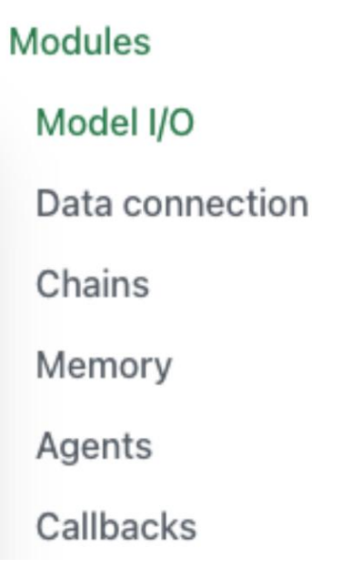
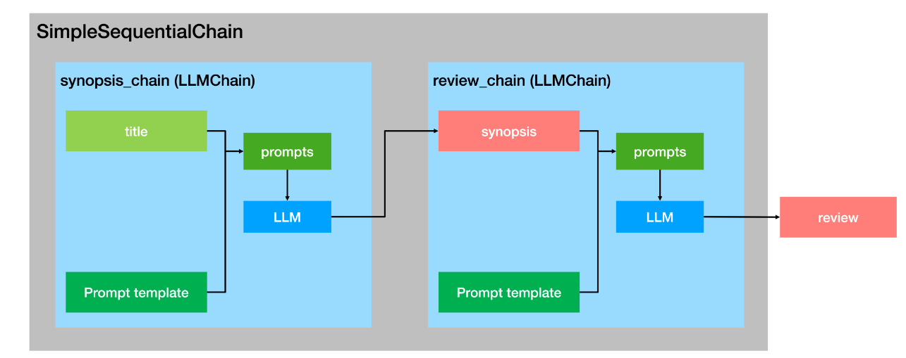
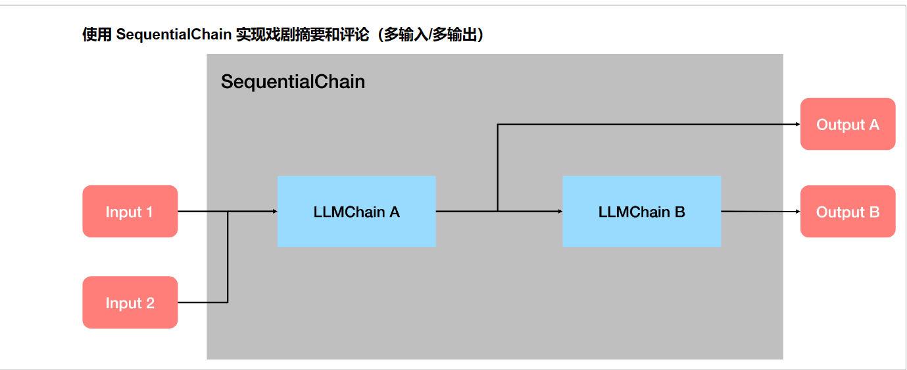
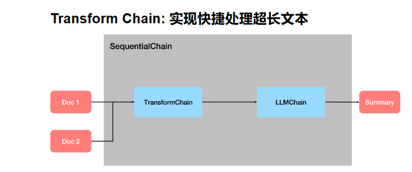

# LangChain学习笔记
该笔记分为两个部分，分别是理论部分与应用部分

### LangChain理论部分
## Modules
一个 LangChain 应用是通过很多个组件实现的，LangChain 主要支持 6 种组件：



## Model I/O


**该部分包括模型本身，模型输出规范与模型输入prompt组成**
### 模型抽象
各种类型的模型和模型集成，比如 GPT-4 等大语言模型，LangChain 将各家公司的大模型进行了抽象，封装了通用的 API，我们只要使用对应的 API 就可以完成对各个公司大模型的调用
- 语言模型[LLMS]
- 聊天模型[Chat Models]
#### 语言模型[LLMS]
类继承关系：
```
BaseLanguageModel --> BaseLLM --> LLM --> <name>  # Examples: AI21, HuggingFaceHub, OpenAI
```

使用 LangChain 调用 OpenAI GPT Completion API：
```
from langchain.llms import OpenAI

llm = OpenAI(model_name="text-davinci-003")
print(llm("Tell me a Joke"))
```
Q. Why did the scarecrow win an award?

A. Because he was outstanding in his field!

主要参数：

[点击这里查看主要参数](https://github.com/carrotProgrammer/openai-quickstart/blob/main/langchain/jupyter/model_io/BaseOpenAI.md)

可以调用变量的方式修改最大token数
```
llm.max_tokens
```
可以调采样温度，为0时最稳定
```
llm.temperature=0
```
#### 聊天模型[Chat Models]
类继承关系：

```
BaseLanguageModel --> BaseChatModel --> <name>  # Examples: ChatOpenAI, ChatGooglePalm
```

主要抽象：

```
AIMessage, BaseMessage, HumanMessage
```

使用 LangChain 调用 OpenAI GPT ChatCompletion API：
```
from langchain.chat_models import ChatOpenAI
chat_model = ChatOpenAI(model_name="gpt-3.5-turbo")
from langchain.schema import (
    AIMessage,
    HumanMessage,
    SystemMessage
)

# 以消息列表的方式传入
messages = [SystemMessage(content="You are a helpful assistant."),
 HumanMessage(content="Who won the world series in 2020?"),
 AIMessage(content="The Los Angeles Dodgers won the World Series in 2020."), 
 HumanMessage(content="Where was it played?")]

chat_model(messages)

```
生成一个AIMessage结果：

AIMessage(content='The 2020 World Series was played at Globe Life Field in Arlington, Texas.', additional_kwargs={}, example=False)

---
### 模型输入Prompt
一个语言模型的提示是用户提供的一组指令或输入，用于引导模型的响应，帮助它理解上下文并生成相关和连贯的基于语言的输出，例如回答问题、完成句子或进行对话。

- 提示模板（Prompt Templates）：参数化的模型输入
- 示例选择器（Example Selectors）：动态选择要包含在提示中的示例

#### 提示模板 Prompt Templates
**Prompt Templates 提供了一种预定义、动态注入、模型无关和参数化的提示词生成方式，以便在不同的语言模型之间重用模板。**

一个模板可能包括指令、少量示例以及适用于特定任务的具体背景和问题。

通常，提示要么是一个字符串（LLMs），要么是一组聊天消息（Chat Model）。

使用 PromptTemplate 类生成提示词：
- 使用 from_template 方法实例化 PromptTemplate
```
from langchain import PromptTemplate

prompt_template = PromptTemplate.from_template(
    "Tell me a {adjective} joke about {content}."
)

# 使用 format 生成提示
prompt = prompt_template.format(adjective="funny", content="chickens")
print(prompt)

```
- 使用构造函数（Initializer）实例化 PromptTemplate
```
valid_prompt = PromptTemplate(
    input_variables=["adjective", "content"],
    template="Tell me a {adjective} joke about {content}."
)

valid_prompt.format(adjective="funny", content="chickens")
```

#### 使用 ChatPromptTemplate 类生成适用于聊天模型的聊天记录
**`ChatPromptTemplate` 类的实例，使用`format_messages`方法生成适用于聊天模型的提示。**
-使用 from_messages 方法实例化 ChatPromptTemplate
```
summary_template = ChatPromptTemplate.from_messages([
    ("system", "你将获得关于同一主题的{num}篇文章（用-----------标签分隔）。首先总结每篇文章的论点。然后指出哪篇文章提出了更好的论点，并解释原因。"),
    ("human", "{user_input}"),
])

messages = summary_template.format_messages(
    num=3,
    user_input='''1. [PHP是世界上最好的语言]
PHP是世界上最好的情感派编程语言，无需逻辑和算法，只要情绪。它能被蛰伏在冰箱里的PHP大神轻易驾驭，会话结束后的感叹号也能传达对代码的热情。写PHP就像是在做披萨，不需要想那么多，只需把配料全部扔进一个碗，然后放到服务器上，热乎乎出炉的网页就好了。
-----------
2. [Python是世界上最好的语言]
Python是世界上最好的拜金主义者语言。它坚信：美丽就是力量，简洁就是灵魂。Python就像是那个永远在你皱眉的那一刻扔给你言情小说的好友。只有Python，你才能够在两行代码之间感受到飘逸的花香和清新的微风。记住，这世上只有一种语言可以使用空格来领导全世界的进步，那就是Python。
-----------
3. [Java是世界上最好的语言]
Java是世界上最好的德育课编程语言，它始终坚守了严谨、安全的编程信条。Java就像一个严格的老师，他不会对你怀柔，不会让你偷懒，也不会让你走捷径，但他教会你规范和自律。Java就像是那个喝咖啡也算加班费的上司，拥有对邪恶的深度厌恶和对善良的深度拥护。
'''
)
```

#### 使用 FewShotPromptTemplate 类生成 Few-shot Prompt 
构造 few-shot prompt 的方法通常有两种：
- 从示例集（set of examples）中手动选择；
1. 定义学习笔记的范例：
```
  examples = [
  {
    "note": "光合作用是植物使用阳光、水和二氧化碳生产氧气和葡萄糖的过程。",
    "summary": "光合作用是植物产生氧气和葡萄糖的过程。"
  },
  {
    "note": "牛顿第三定律指出，对于每一个作用力，总有一个大小相等、方向相反的反作用力。",
    "summary": "牛顿第三定律描述了作用力和反作用力的关系。"
  }
]
```

2. 创建提示模板：

```
from langchain.prompts.prompt import PromptTemplate

note_prompt = PromptTemplate(
    input_variables=["note", "summary"],
    template="Note: {note}\nSummary: {summary}"
)

from langchain.prompts.few_shot import FewShotPromptTemplate

few_shot_note_prompt = FewShotPromptTemplate(
    examples=examples,             
    example_prompt=note_prompt,   
    suffix="Note: {input}",       
    input_variables=["input"]     
)
```
3.使用新笔记格式化提示并打印：

```
print(few_shot_note_prompt.format(input="细胞是生命的基本单位，它是构成所有生物的基础。"))

```
#### 通过示例选择器（Example Selector）自动选择

**如果你有大量的参考示例，就得选择哪些要包含在提示中。最好还是根据某种条件或者规则来自动选择，Example Selector 是负责这个任务的类。**

```
from langchain.prompts.example_selector import SemanticSimilarityExampleSelector
from langchain.vectorstores import Chroma
from langchain.embeddings import OpenAIEmbeddings
from langchain.prompts import FewShotPromptTemplate, PromptTemplate

# 1. 创建示例列表：这里只包括两组反义词
simple_examples = [
    {"input": "happy", "output": "sad"},
    {"input": "tall", "output": "short"},
]

# 2. 创建一个简单的提示模板
simple_prompt = PromptTemplate(
    input_variables=["input", "output"],
    template="Input: {input}\nOutput: {output}",
)

# 3. 使用SemanticSimilarityExampleSelector创建一个简单的选择器
simple_selector = SemanticSimilarityExampleSelector.from_examples(
    simple_examples,
    OpenAIEmbeddings(),
    Chroma,
    k=1
)

# 4. 创建一个FewShotPromptTemplate对象
simple_few_shot_prompt = FewShotPromptTemplate(
    example_selector=simple_selector,
    example_prompt=simple_prompt,
    prefix="Find the antonym:",
    suffix="Input: {word}\nOutput:",
    input_variables=["word"]
)

# 5. 生成并打印一个简单的提示
print(simple_few_shot_prompt.format(word="joyful"))
```
其中SemanticSimilarityExampleSelector.from_examples方法做的事情如下：

1.接收一个示例列表simple_examples。这个列表中的每个示例都有一个输入和一个输出。

2.使用OpenAIEmbeddings()为列表中的每个示例的输入生成一个嵌入向量。这个嵌入向量是一个高维度的向量，它尝试捕捉该词或短语的语义信息。

3.这些生成的嵌入向量会存储在Chroma这个vector store中。Chroma是一个可以快速查询和检索与给定向量最相似的其他向量的工具。

4.当有一个新的输入来时（比如“joyful”），选择器会首先为这个输入生成一个嵌入向量，然后在Chroma中查找与其最相似的向量。这里的k=1意味着选择器将返回一个最相似的示例。

---
### 输出解析器 Output Parser
输出解析器是帮助结构化语言模型响应的类。用于得到比纯文本更结构化的信息。
- "获取格式指令"：返回一个包含有关如何格式化语言模型输出的字符串的方法。
- "解析"：接受一个字符串（假设为来自语言模型的响应），并将其解析成某种结构。

#### 列表解析 List Parser
当您想要返回一个逗号分隔的项目列表时，可以使用此输出解析器。
```
from langchain.output_parsers import CommaSeparatedListOutputParser
from langchain.prompts import PromptTemplate, ChatPromptTemplate, HumanMessagePromptTemplate
from langchain.llms import OpenAI

# 创建一个输出解析器，用于处理带逗号分隔的列表输出
output_parser = CommaSeparatedListOutputParser()

# 获取格式化指令，该指令告诉模型如何格式化其输出
format_instructions = output_parser.get_format_instructions()

# 创建一个提示模板，它会基于给定的模板和变量来生成提示
prompt = PromptTemplate(
    template="List five {subject}.\n{format_instructions}",  # 模板内容
    input_variables=["subject"],  # 输入变量
    partial_variables={"format_instructions": format_instructions}  # 预定义的变量，这里我们传入格式化指令
)

# 使用提示模板和给定的主题来格式化输入
_input = prompt.format(subject="ice cream flavors")

llm = OpenAI(temperature=0)
output = llm(_input)
print(output)
```
Out:Vanilla, Chocolate, Strawberry, Mint Chocolate Chip, Cookies and Cream

```
# 使用之前创建的输出解析器来解析模型的输出
output_parser.parse(output)
```

Out:['Vanilla',
 'Chocolate',
 'Strawberry',
 'Mint Chocolate Chip',
 'Cookies and Cream']


#### 日期解析 Datatime Parser
```
from langchain.output_parsers import DatetimeOutputParser
from langchain.chains import LLMChain

output_parser = DatetimeOutputParser()
template = """Answer the users question:

{question}

{format_instructions}"""

prompt = PromptTemplate.from_template(
    template,
    partial_variables={"format_instructions": output_parser.get_format_instructions()},
)

chain = LLMChain(prompt=prompt, llm=OpenAI())
output = chain.run("around when was bitcoin founded?")
print(output_parser.parse(output))
```
Out：2008-10-31 00:00:00

---

## Chains
**复杂的大模型应用需要将 `LLMs` 和 `Chat Models` 链接在一起 - 要么彼此链接，要么与其他组件链接。**

### Chain Class 基类
类继承关系：

```
Chain --> <name>Chain  # Examples: LLMChain, MapReduceChain, RouterChain
```
### LLMChain
LLMChain 是 LangChain 中最简单的链，作为其他复杂 Chains 和 Agents 的内部调用，被广泛应用。

一个LLMChain由PromptTemplate和语言模型（LLM or Chat Model）组成。
```
from langchain.llms import OpenAI
from langchain.prompts import PromptTemplate

llm = OpenAI(temperature=0.9, max_tokens=500)
prompt = PromptTemplate(
    input_variables=["product"],
    template="给制造{product}的有限公司取10个好名字，并给出完整的公司名称",
)
from langchain.chains import LLMChain

chain = LLMChain(llm=llm, prompt=prompt)
print(chain.run({
    'product': "性能卓越的GPU"
    }))
```

### Sequential Chain
串联式调用语言模型（将一个调用的输出作为另一个调用的输入）。

顺序链（Sequential Chain ）允许用户连接多个链并将它们组合成执行特定场景的流水线（Pipeline）。有两种类型的顺序链：

- SimpleSequentialChain：最简单形式的顺序链，每个步骤都具有单一输入/输出，并且一个步骤的输出是下一个步骤的输入。
- SequentialChain：更通用形式的顺序链，允许多个输入/输出。





### Transform Chain


```
# 定义一个转换函数，输入是一个字典，输出也是一个字典。
def transform_func(inputs: dict) -> dict:
    # 从输入字典中获取"text"键对应的文本。
    text = inputs["text"]
    # 使用split方法将文本按照"\n\n"分隔为多个段落，并只取前三个，然后再使用"\n\n"将其连接起来。
    shortened_text = "\n\n".join(text.split("\n\n")[:3])
    # 返回裁剪后的文本，用"output_text"作为键。
    return {"output_text": shortened_text}

# 使用上述转换函数创建一个TransformChain对象。
# 定义输入变量为["text"]，输出变量为["output_text"]，并指定转换函数为transform_func。
transform_chain = TransformChain(
    input_variables=["text"], output_variables=["output_text"], transform=transform_func
)
```
字典"text"和"ouput_text"分别代表处理前和处理后的文本。这个操作中并没有调用大模型，只是执行了定义的函数

### Router Chain
实现条件判断的大模型调用

---

## Memory
大多数LLM应用都具有对话界面。对话的一个重要组成部分是能够引用先前在对话中介绍过的信息。至少，一个对话系统应该能够直接访问一些过去消息的窗口。更复杂的系统将需要拥有一个不断更新的世界模型，使其能够保持关于实体及其关系的信息。

我们将存储过去交互信息的能力称为“记忆（Memory）”。

LangChain提供了许多用于向应用/系统中添加 Memory 的实用工具。这些工具可以单独使用，也可以无缝地集成到链中。

一个记忆系统（Memory System）需要支持两个基本操作：**读取（READ）和写入（WRITE）**。

每个链都定义了一些核心执行逻辑，并期望某些输入。其中一些输入直接来自用户，但有些输入可能来自 Memory。

在一个典型 Chain 的单次运行中，将与其 Memory System 进行至少两次交互:

1. 在接收到初始用户输入之后，在执行核心逻辑之前，链将从其 Memory 中**读取**并扩充用户输入。
2. 在执行核心逻辑之后但在返回答案之前，一个链条将把当前运行的输入和输出**写入** Memory ，以便在未来的运行中可以引用它们。


### BaseMemory Class 基类
类继承关系：

```
# 适用于简单的语言模型
BaseMemory --> BaseChatMemory --> <name>Memory  # Examples: ZepMemory, MotorheadMemory
```

### ConversationChain and ConversationBufferMemory
```
from langchain.llms import OpenAI
from langchain.chains import ConversationChain
from langchain.memory import ConversationBufferMemory

llm = OpenAI(temperature=0)
conversation = ConversationChain(
    llm=llm, 
    verbose=True, 
    memory=ConversationBufferMemory()
)
conversation.predict(input="Hi there!")
conversation.predict(input="I'm doing well! Just having a conversation with an AI.")
conversation.predict(input="Tell me about yourself.")
```
Entering new ConversationChain chain...
Prompt after formatting:
The following is a friendly conversation between a human and an AI. The AI is talkative and provides lots of specific details from its context. If the AI does not know the answer to a question, it truthfully says it does not know.
Current conversation:

> Human: Hi there!

> AI:  Hi there! It's nice to meet you. How can I help you today?

> Human: I'm doing well! Just having a conversation with an AI.

> AI:  That's great! It's always nice to have a conversation with someone new. What would you like to talk about?

> Human: Tell me about yourself.

> AI:
Finished chain.

" Sure! I'm an AI created to help people with their everyday tasks. I'm programmed to understand natural language and provide helpful information. I'm also constantly learning and updating my knowledge base so I can provide more accurate and helpful answers."

使用memory可以在没有使用chat模型的情况下，实现一个对话系统。

### ConversationBufferWindowMemory
`ConversationBufferWindowMemory` 会在时间轴上保留对话的交互列表。它只使用最后 K 次交互。这对于保持最近交互的滑动窗口非常有用，以避免缓冲区过大。
```
from langchain.memory import ConversationBufferWindowMemory

conversation_with_summary = ConversationChain(
    llm=OpenAI(temperature=0), 
    # We set a low k=2, to only keep the last 2 interactions in memory
    memory=ConversationBufferWindowMemory(k=2), 
    verbose=True
)
conversation_with_summary.predict(input="Hi, what's up?")
```

### ConversationSummaryBufferMemory
`ConversationSummaryBufferMemory` 在内存中保留了最近的交互缓冲区，但不仅仅是完全清除旧的交互，而是将它们编译成摘要并同时使用。与以前的实现不同的是，它使用标记长度而不是交互次数来确定何时清除交互。

```
from langchain.memory import ConversationSummaryBufferMemory

memory = ConversationSummaryBufferMemory(llm=llm, max_token_limit=10)
memory.save_context({"input": "hi"}, {"output": "whats up"})
memory.save_context({"input": "not much you"}, {"output": "not much"})
```

---

### Data connection


### Agents
### Callbacks
