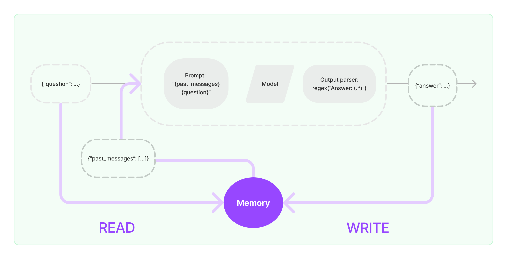

# LangChain学习笔记
该笔记分为两个部分，分别是理论部分与应用部分

# LangChain理论部分
## Modules
一个 LangChain 应用是通过很多个组件实现的，LangChain 主要支持 6 种组件：


## Model I/O


**该部分包括模型本身，模型输出规范与模型输入prompt组成**
### 模型抽象
各种类型的模型和模型集成，比如 GPT-4 等大语言模型，LangChain 将各家公司的大模型进行了抽象，封装了通用的 API，我们只要使用对应的 API 就可以完成对各个公司大模型的调用
- 语言模型[LLMS]
- 聊天模型[Chat Models]
#### 语言模型[LLMS]
类继承关系：
```
BaseLanguageModel --> BaseLLM --> LLM --> <name>  # Examples: AI21, HuggingFaceHub, OpenAI
```

使用 LangChain 调用 OpenAI GPT Completion API：
```
from langchain.llms import OpenAI

llm = OpenAI(model_name="text-davinci-003")
print(llm("Tell me a Joke"))
```
Q. Why did the scarecrow win an award?

A. Because he was outstanding in his field!

主要参数：

[点击这里查看主要参数](https://github.com/carrotProgrammer/openai-quickstart/blob/main/langchain/jupyter/model_io/BaseOpenAI.md)

可以调用变量的方式修改最大token数
```
llm.max_tokens
```
可以调采样温度，为0时最稳定
```
llm.temperature=0
```
#### 聊天模型[Chat Models]
类继承关系：

```
BaseLanguageModel --> BaseChatModel --> <name>  # Examples: ChatOpenAI, ChatGooglePalm
```

主要抽象：

```
AIMessage, BaseMessage, HumanMessage
```

使用 LangChain 调用 OpenAI GPT ChatCompletion API：
```
from langchain.chat_models import ChatOpenAI
chat_model = ChatOpenAI(model_name="gpt-3.5-turbo")
from langchain.schema import (
    AIMessage,
    HumanMessage,
    SystemMessage
)

# 以消息列表的方式传入
messages = [SystemMessage(content="You are a helpful assistant."),
 HumanMessage(content="Who won the world series in 2020?"),
 AIMessage(content="The Los Angeles Dodgers won the World Series in 2020."), 
 HumanMessage(content="Where was it played?")]

chat_model(messages)

```
生成一个AIMessage结果：

AIMessage(content='The 2020 World Series was played at Globe Life Field in Arlington, Texas.', additional_kwargs={}, example=False)

---
### 模型输入Prompt
一个语言模型的提示是用户提供的一组指令或输入，用于引导模型的响应，帮助它理解上下文并生成相关和连贯的基于语言的输出，例如回答问题、完成句子或进行对话。

- 提示模板（Prompt Templates）：参数化的模型输入
- 示例选择器（Example Selectors）：动态选择要包含在提示中的示例

#### 提示模板 Prompt Templates
**Prompt Templates 提供了一种预定义、动态注入、模型无关和参数化的提示词生成方式，以便在不同的语言模型之间重用模板。**

一个模板可能包括指令、少量示例以及适用于特定任务的具体背景和问题。

通常，提示要么是一个字符串（LLMs），要么是一组聊天消息（Chat Model）。

使用 PromptTemplate 类生成提示词：
- 使用 from_template 方法实例化 PromptTemplate
```
from langchain import PromptTemplate

prompt_template = PromptTemplate.from_template(
    "Tell me a {adjective} joke about {content}."
)

# 使用 format 生成提示
prompt = prompt_template.format(adjective="funny", content="chickens")
print(prompt)

```
- 使用构造函数（Initializer）实例化 PromptTemplate
```
valid_prompt = PromptTemplate(
    input_variables=["adjective", "content"],
    template="Tell me a {adjective} joke about {content}."
)

valid_prompt.format(adjective="funny", content="chickens")
```

#### 使用 ChatPromptTemplate 类生成适用于聊天模型的聊天记录
**`ChatPromptTemplate` 类的实例，使用`format_messages`方法生成适用于聊天模型的提示。**
-使用 from_messages 方法实例化 ChatPromptTemplate
```
summary_template = ChatPromptTemplate.from_messages([
    ("system", "你将获得关于同一主题的{num}篇文章（用-----------标签分隔）。首先总结每篇文章的论点。然后指出哪篇文章提出了更好的论点，并解释原因。"),
    ("human", "{user_input}"),
])

messages = summary_template.format_messages(
    num=3,
    user_input='''1. [PHP是世界上最好的语言]
PHP是世界上最好的情感派编程语言，无需逻辑和算法，只要情绪。它能被蛰伏在冰箱里的PHP大神轻易驾驭，会话结束后的感叹号也能传达对代码的热情。写PHP就像是在做披萨，不需要想那么多，只需把配料全部扔进一个碗，然后放到服务器上，热乎乎出炉的网页就好了。
-----------
2. [Python是世界上最好的语言]
Python是世界上最好的拜金主义者语言。它坚信：美丽就是力量，简洁就是灵魂。Python就像是那个永远在你皱眉的那一刻扔给你言情小说的好友。只有Python，你才能够在两行代码之间感受到飘逸的花香和清新的微风。记住，这世上只有一种语言可以使用空格来领导全世界的进步，那就是Python。
-----------
3. [Java是世界上最好的语言]
Java是世界上最好的德育课编程语言，它始终坚守了严谨、安全的编程信条。Java就像一个严格的老师，他不会对你怀柔，不会让你偷懒，也不会让你走捷径，但他教会你规范和自律。Java就像是那个喝咖啡也算加班费的上司，拥有对邪恶的深度厌恶和对善良的深度拥护。
'''
)
```

#### 使用 FewShotPromptTemplate 类生成 Few-shot Prompt 
构造 few-shot prompt 的方法通常有两种：
- 从示例集（set of examples）中手动选择；
1. 定义学习笔记的范例：
```
  examples = [
  {
    "note": "光合作用是植物使用阳光、水和二氧化碳生产氧气和葡萄糖的过程。",
    "summary": "光合作用是植物产生氧气和葡萄糖的过程。"
  },
  {
    "note": "牛顿第三定律指出，对于每一个作用力，总有一个大小相等、方向相反的反作用力。",
    "summary": "牛顿第三定律描述了作用力和反作用力的关系。"
  }
]
```

2. 创建提示模板：

```
from langchain.prompts.prompt import PromptTemplate

note_prompt = PromptTemplate(
    input_variables=["note", "summary"],
    template="Note: {note}\nSummary: {summary}"
)

from langchain.prompts.few_shot import FewShotPromptTemplate

few_shot_note_prompt = FewShotPromptTemplate(
    examples=examples,             
    example_prompt=note_prompt,   
    suffix="Note: {input}",       
    input_variables=["input"]     
)
```
3.使用新笔记格式化提示并打印：

```
print(few_shot_note_prompt.format(input="细胞是生命的基本单位，它是构成所有生物的基础。"))

```
#### 通过示例选择器（Example Selector）自动选择

**如果你有大量的参考示例，就得选择哪些要包含在提示中。最好还是根据某种条件或者规则来自动选择，Example Selector 是负责这个任务的类。**

```
from langchain.prompts.example_selector import SemanticSimilarityExampleSelector
from langchain.vectorstores import Chroma
from langchain.embeddings import OpenAIEmbeddings
from langchain.prompts import FewShotPromptTemplate, PromptTemplate

# 1. 创建示例列表：这里只包括两组反义词
simple_examples = [
    {"input": "happy", "output": "sad"},
    {"input": "tall", "output": "short"},
]

# 2. 创建一个简单的提示模板
simple_prompt = PromptTemplate(
    input_variables=["input", "output"],
    template="Input: {input}\nOutput: {output}",
)

# 3. 使用SemanticSimilarityExampleSelector创建一个简单的选择器
simple_selector = SemanticSimilarityExampleSelector.from_examples(
    simple_examples,
    OpenAIEmbeddings(),
    Chroma,
    k=1
)

# 4. 创建一个FewShotPromptTemplate对象
simple_few_shot_prompt = FewShotPromptTemplate(
    example_selector=simple_selector,
    example_prompt=simple_prompt,
    prefix="Find the antonym:",
    suffix="Input: {word}\nOutput:",
    input_variables=["word"]
)

# 5. 生成并打印一个简单的提示
print(simple_few_shot_prompt.format(word="joyful"))
```
其中SemanticSimilarityExampleSelector.from_examples方法做的事情如下：

1.接收一个示例列表simple_examples。这个列表中的每个示例都有一个输入和一个输出。

2.使用OpenAIEmbeddings()为列表中的每个示例的输入生成一个嵌入向量。这个嵌入向量是一个高维度的向量，它尝试捕捉该词或短语的语义信息。

3.这些生成的嵌入向量会存储在Chroma这个vector store中。Chroma是一个可以快速查询和检索与给定向量最相似的其他向量的工具。

4.当有一个新的输入来时（比如“joyful”），选择器会首先为这个输入生成一个嵌入向量，然后在Chroma中查找与其最相似的向量。这里的k=1意味着选择器将返回一个最相似的示例。

---
### 输出解析器 Output Parser
输出解析器是帮助结构化语言模型响应的类。用于得到比纯文本更结构化的信息。
- "获取格式指令"：返回一个包含有关如何格式化语言模型输出的字符串的方法。
- "解析"：接受一个字符串（假设为来自语言模型的响应），并将其解析成某种结构。

#### 列表解析 List Parser
当您想要返回一个逗号分隔的项目列表时，可以使用此输出解析器。
```
from langchain.output_parsers import CommaSeparatedListOutputParser
from langchain.prompts import PromptTemplate, ChatPromptTemplate, HumanMessagePromptTemplate
from langchain.llms import OpenAI

# 创建一个输出解析器，用于处理带逗号分隔的列表输出
output_parser = CommaSeparatedListOutputParser()

# 获取格式化指令，该指令告诉模型如何格式化其输出
format_instructions = output_parser.get_format_instructions()

# 创建一个提示模板，它会基于给定的模板和变量来生成提示
prompt = PromptTemplate(
    template="List five {subject}.\n{format_instructions}",  # 模板内容
    input_variables=["subject"],  # 输入变量
    partial_variables={"format_instructions": format_instructions}  # 预定义的变量，这里我们传入格式化指令
)

# 使用提示模板和给定的主题来格式化输入
_input = prompt.format(subject="ice cream flavors")

llm = OpenAI(temperature=0)
output = llm(_input)
print(output)
```
Out:Vanilla, Chocolate, Strawberry, Mint Chocolate Chip, Cookies and Cream

```
# 使用之前创建的输出解析器来解析模型的输出
output_parser.parse(output)
```

Out:['Vanilla',
 'Chocolate',
 'Strawberry',
 'Mint Chocolate Chip',
 'Cookies and Cream']


#### 日期解析 Datatime Parser
```
from langchain.output_parsers import DatetimeOutputParser
from langchain.chains import LLMChain

output_parser = DatetimeOutputParser()
template = """Answer the users question:

{question}

{format_instructions}"""

prompt = PromptTemplate.from_template(
    template,
    partial_variables={"format_instructions": output_parser.get_format_instructions()},
)

chain = LLMChain(prompt=prompt, llm=OpenAI())
output = chain.run("around when was bitcoin founded?")
print(output_parser.parse(output))
```
Out：2008-10-31 00:00:00

---

## Chains
**复杂的大模型应用需要将 `LLMs` 和 `Chat Models` 链接在一起 - 要么彼此链接，要么与其他组件链接。**

### Chain Class 基类
类继承关系：

```
Chain --> <name>Chain  # Examples: LLMChain, MapReduceChain, RouterChain
```
### LLMChain
LLMChain 是 LangChain 中最简单的链，作为其他复杂 Chains 和 Agents 的内部调用，被广泛应用。

一个LLMChain由PromptTemplate和语言模型（LLM or Chat Model）组成。
```
from langchain.llms import OpenAI
from langchain.prompts import PromptTemplate

llm = OpenAI(temperature=0.9, max_tokens=500)
prompt = PromptTemplate(
    input_variables=["product"],
    template="给制造{product}的有限公司取10个好名字，并给出完整的公司名称",
)
from langchain.chains import LLMChain

chain = LLMChain(llm=llm, prompt=prompt)
print(chain.run({
    'product': "性能卓越的GPU"
    }))
```

### Sequential Chain
串联式调用语言模型（将一个调用的输出作为另一个调用的输入）。

顺序链（Sequential Chain ）允许用户连接多个链并将它们组合成执行特定场景的流水线（Pipeline）。有两种类型的顺序链：

- SimpleSequentialChain：最简单形式的顺序链，每个步骤都具有单一输入/输出，并且一个步骤的输出是下一个步骤的输入。
- SequentialChain：更通用形式的顺序链，允许多个输入/输出。


### Transform Chain


```
# 定义一个转换函数，输入是一个字典，输出也是一个字典。
def transform_func(inputs: dict) -> dict:
    # 从输入字典中获取"text"键对应的文本。
    text = inputs["text"]
    # 使用split方法将文本按照"\n\n"分隔为多个段落，并只取前三个，然后再使用"\n\n"将其连接起来。
    shortened_text = "\n\n".join(text.split("\n\n")[:3])
    # 返回裁剪后的文本，用"output_text"作为键。
    return {"output_text": shortened_text}

# 使用上述转换函数创建一个TransformChain对象。
# 定义输入变量为["text"]，输出变量为["output_text"]，并指定转换函数为transform_func。
transform_chain = TransformChain(
    input_variables=["text"], output_variables=["output_text"], transform=transform_func
)
```
字典"text"和"ouput_text"分别代表处理前和处理后的文本。这个操作中并没有调用大模型，只是执行了定义的函数

### Router Chain
实现条件判断的大模型调用

---

## Memory
大多数LLM应用都具有对话界面。对话的一个重要组成部分是能够引用先前在对话中介绍过的信息。至少，一个对话系统应该能够直接访问一些过去消息的窗口。更复杂的系统将需要拥有一个不断更新的世界模型，使其能够保持关于实体及其关系的信息。

我们将存储过去交互信息的能力称为“记忆（Memory）”。

LangChain提供了许多用于向应用/系统中添加 Memory 的实用工具。这些工具可以单独使用，也可以无缝地集成到链中。

一个记忆系统（Memory System）需要支持两个基本操作：**读取（READ）和写入（WRITE）**。

每个链都定义了一些核心执行逻辑，并期望某些输入。其中一些输入直接来自用户，但有些输入可能来自 Memory。

在一个典型 Chain 的单次运行中，将与其 Memory System 进行至少两次交互:

1. 在接收到初始用户输入之后，在执行核心逻辑之前，链将从其 Memory 中**读取**并扩充用户输入。
2. 在执行核心逻辑之后但在返回答案之前，一个链条将把当前运行的输入和输出**写入** Memory ，以便在未来的运行中可以引用它们。


### BaseMemory Class 基类
类继承关系：

```
# 适用于简单的语言模型
BaseMemory --> BaseChatMemory --> <name>Memory  # Examples: ZepMemory, MotorheadMemory
```

### ConversationChain and ConversationBufferMemory
```
from langchain.llms import OpenAI
from langchain.chains import ConversationChain
from langchain.memory import ConversationBufferMemory

llm = OpenAI(temperature=0)
conversation = ConversationChain(
    llm=llm, 
    verbose=True, 
    memory=ConversationBufferMemory()
)
conversation.predict(input="Hi there!")
conversation.predict(input="I'm doing well! Just having a conversation with an AI.")
conversation.predict(input="Tell me about yourself.")
```
Entering new ConversationChain chain...
Prompt after formatting:
The following is a friendly conversation between a human and an AI. The AI is talkative and provides lots of specific details from its context. If the AI does not know the answer to a question, it truthfully says it does not know.
Current conversation:

> Human: Hi there!

> AI:  Hi there! It's nice to meet you. How can I help you today?

> Human: I'm doing well! Just having a conversation with an AI.

> AI:  That's great! It's always nice to have a conversation with someone new. What would you like to talk about?

> Human: Tell me about yourself.

> AI:
Finished chain.

" Sure! I'm an AI created to help people with their everyday tasks. I'm programmed to understand natural language and provide helpful information. I'm also constantly learning and updating my knowledge base so I can provide more accurate and helpful answers."

使用memory可以在没有使用chat模型的情况下，实现一个对话系统。

### ConversationBufferWindowMemory
`ConversationBufferWindowMemory` 会在时间轴上保留对话的交互列表。它只使用最后 K 次交互。这对于保持最近交互的滑动窗口非常有用，以避免缓冲区过大。
```
from langchain.memory import ConversationBufferWindowMemory

conversation_with_summary = ConversationChain(
    llm=OpenAI(temperature=0), 
    # We set a low k=2, to only keep the last 2 interactions in memory
    memory=ConversationBufferWindowMemory(k=2), 
    verbose=True
)
conversation_with_summary.predict(input="Hi, what's up?")
```

### ConversationSummaryBufferMemory
`ConversationSummaryBufferMemory` 在内存中保留了最近的交互缓冲区，但不仅仅是完全清除旧的交互，而是将它们编译成摘要并同时使用。与以前的实现不同的是，它使用标记长度而不是交互次数来确定何时清除交互。

```
from langchain.memory import ConversationSummaryBufferMemory

memory = ConversationSummaryBufferMemory(llm=llm, max_token_limit=10)
memory.save_context({"input": "hi"}, {"output": "whats up"})
memory.save_context({"input": "not much you"}, {"output": "not much"})
```

---

## Data connection
许多LLM应用需要用户特定的数据，这些数据不属于模型的训练集。LangChain通过以下方式为你提供了加载、转换、存储和查询数据的构建模块：

- 文档加载器：从许多不同的来源加载文档
- 文档转换器：分割文档，删除多余的文档等-
- 文本嵌入模型：采取非结构化文本，并把它变成一个浮点数的列表 矢量存储：存储和
- 搜索嵌入式数据
- 检索器：查询你的数据
  
整体流程：


### BaseLoader
`BaseLoader` 类定义了如何从不同的数据源加载文档，并提供了一个可选的方法来分割加载的文档。使用这个类作为基础，开发者可以为特定的数据源创建自定义的加载器，并确保所有这些加载器都提供了加载数据的方法。load_and_split方法还提供了一个额外的功能，可以根据需要将加载的文档分割为更小的块，每个块使用List数据结构存储。load方法是抽象方法。

```python
# 基础加载器类。
class BaseLoader(ABC):
    """基础加载器类定义。"""

    # 抽象方法，所有子类必须实现此方法。
    @abstractmethod
    def load(self) -> List[Document]:
        """加载数据并将其转换为文档对象。"""

    # 该方法可以加载文档，并将其分割为更小的块。
    def load_and_split(
        self, text_splitter: Optional[TextSplitter] = None
    ) -> List[Document]:
        """加载文档并分割成块。"""
        # 如果没有提供特定的文本分割器，使用默认的字符文本分割器。
        if text_splitter is None:
            _text_splitter: TextSplitter = RecursiveCharacterTextSplitter()
        else:
            _text_splitter = text_splitter
        # 先加载文档。
        docs = self.load()
        # 然后使用_text_splitter来分割每一个文档。
        return _text_splitter.split_documents(docs)
```
其子类有TextLoader用于加载Txt文件，ArxivLoader用于加载ArXiv论文，UnstructuredURLLoader用于加载网页内容等等。更多查看langchain文档：(https://github.com/langchain-ai/langchain/tree/master/libs/langchain/langchain/document_loaders)

### Document Transformers
一旦加载了文档，通常会希望对其进行转换以更好地适应您的应用程序。
最简单的例子是，您可能希望将长文档拆分为较小的块，以适应模型的上下文窗口。LangChain具有许多内置的文档转换器，可以轻松地拆分、合并、过滤和其他操作文档。

#### Document类
大部分通过loader加载后的内容，都将存储为`Document`对象，`Document`的类，允许用户与文档的内容进行交互，可以查看文档的段落、摘要，以及使用查找功能来查询文档中的特定字符串。

```python
# 基于BaseModel定义的文档类。
class Document(BaseModel):
    """接口，用于与文档进行交互。"""

    # 文档的主要内容。
    page_content: str
    # 用于查找的字符串。
    lookup_str: str = ""
    # 查找的索引，初次默认为0。
    lookup_index = 0
    # 用于存储任何与文档相关的元数据。
    metadata: dict = Field(default_factory=dict)

    @property
    def paragraphs(self) -> List[str]:
        """页面的段落列表。"""
        # 使用"\n\n"将内容分割为多个段落。
        return self.page_content.split("\n\n")

    @property
    def summary(self) -> str:
        """页面的摘要（即第一段）。"""
        # 返回第一个段落作为摘要。
        return self.paragraphs[0]

    # 这个方法模仿命令行中的查找功能。
    def lookup(self, string: str) -> str:
        """在页面中查找一个词，模仿cmd-F功能。"""
        # 如果输入的字符串与当前的查找字符串不同，则重置查找字符串和索引。
        if string.lower() != self.lookup_str:
            self.lookup_str = string.lower()
            self.lookup_index = 0
        else:
            # 如果输入的字符串与当前的查找字符串相同，则查找索引加1。
            self.lookup_index += 1
        # 找出所有包含查找字符串的段落。
        lookups = [p for p in self.paragraphs if self.lookup_str in p.lower()]
        # 根据查找结果返回相应的信息。
        if len(lookups) == 0:
            return "No Results"
        elif self.lookup_index >= len(lookups):
            return "No More Results"
        else:
            result_prefix = f"(Result {self.lookup_index + 1}/{len(lookups)})"
            return f"{result_prefix} {lookups[self.lookup_index]}"
```
#### Text Splitters 文本分割器
当你想处理长篇文本时，有必要将文本分成块。为了方便嵌入，理想情况下，你希望将语义相关的文本片段放在一起。"语义相关"的含义可能取决于文本类型。

从高层次上看，文本分割器的工作原理如下：

1. 将文本分成小而有意义的块（通常是句子）。
2. 开始将这些小块组合成较大的块，直到达到某个大小（通过某个函数进行测量）。
3. 一旦达到该大小，使该块成为自己独立的一部分，并开始创建一个具有一定重叠（以保持上下文关系）的新文本块。

这意味着您可以沿两个不同轴向定制您的文本分割器：

1. 如何拆分文字
2. 如何测量块大小

#### 使用 `RecursiveCharacterTextSplitter` 文本分割器

该文本分割器接受一个字符列表作为参数，根据第一个字符进行切块，但如果任何切块太大，则会继续移动到下一个字符，并以此类推。默认情况下，它尝试进行切割的字符包括 `["\n\n", "\n", " ", ""]`

除了控制可以进行切割的字符外，您还可以控制其他一些内容：

- length_function：用于计算切块长度的方法。默认只计算字符数，但通常在这里传递一个令牌计数器。
- chunk_size：您的切块的最大大小（由长度函数测量）。
- chunk_overlap：切块之间的最大重叠部分。保持一定程度的重叠可以使得各个切块之间保持连贯性（例如滑动窗口）。
- add_start_index：是否在元数据中包含每个切块在原始文档中的起始位置。

更多的处理案例可以参考：(https://zhuanlan.zhihu.com/p/640424318)

#### 使用Embedding类
嵌入的概念不在这具体展开，简单来讲是将高维字符串转换成较低维的向量并保留语义信息。

Embeddings类是一个专门用于与文本嵌入模型进行交互的类。有许多嵌入模型提供者（OpenAI、Cohere、Hugging Face等）-这个类旨在为所有这些提供者提供一个标准接口。

嵌入将一段文本创建成向量表示。这非常有用，因为它意味着我们可以在向量空间中思考文本，并且可以执行语义搜索等操作，在向量空间中寻找最相似的文本片段。

LangChain中基础的Embeddings类公开了两种方法：一种用于对文档进行嵌入，另一种用于对查询进行嵌入。前者输入多个文本，而后者输入单个文本。之所以将它们作为两个独立的方法，是因为某些嵌入提供者针对要搜索的文件和查询（搜索查询本身）具有不同的嵌入方法。

#### Vector Stores
存储和搜索非结构化数据最常见的方法之一是将其嵌入并存储生成的嵌入向量，然后在查询时将非结构化查询进行嵌入，并检索与嵌入查询“最相似”的嵌入向量。

向量存储库负责为您存储已经过嵌入处理的数据并执行向量搜索。


下面以Chroma向量数据库为例展示Connection各环节：
```
# 安装必要依赖包
!pip install chromadb

from langchain.document_loaders import TextLoader
from langchain.embeddings.openai import OpenAIEmbeddings
from langchain.text_splitter import CharacterTextSplitter
from langchain.vectorstores import Chroma

# 加载长文本
path = "C:\\Users\\lenovo\\openai-quickstart\\langchain\\tests\\state_of_the_union.txt"

raw_documents = TextLoader(path, encoding='utf-8').load()

# 实例化文本分割器
text_splitter = CharacterTextSplitter(chunk_size=100, chunk_overlap=0)
# 分割文本
documents = text_splitter.split_documents(raw_documents)

# 将分割后的文本，使用 OpenAI 嵌入模型获取嵌入向量，并存储在 Chroma 中
db = Chroma.from_documents(documents, OpenAIEmbeddings())

# 使用文本进行语义相似度搜索
query = "What did the president say about Ketanji Brown Jackson"
docs = db.similarity_search(query)
print(docs[0].page_content)

# 使用嵌入向量进行语义相似度搜索
# embeddings_model = OpenAIEmbeddings()
# embedding_vector = embeddings_model.embed_query(query)
embedding_vector = OpenAIEmbeddings().embed_query(query)
docs = db.similarity_search_by_vector(embedding_vector)
print(docs[0].page_content)

```

## Agents

代理主要分为两种：

- 执行代理：在每一步骤需要执行前，使用所有先前执行的输出来决定下一个执行
- 计划并执行代理：预先决定完整的操作顺序，然后执行所有操作而不更新计划

执行代理适合小型任务，而计划和执行代理更适合需要维护长期目标和焦点的复杂或长期运行的任务。通常，最好的方法是通过让计划和执行代理使用执行代理来执行计划，将执行代理的即时性与计划和执行代理的规划能力结合起来。

代理涉及的其他抽象包括：

- 工具：代理可以采取的操作。为代理提供哪些工具很大程度上取决于您希望代理做什么
- 工具包：可在特定用例中一起使用的工具集合的包装。例如，为了让代理与 SQL 数据库交互，它可能需要一个工具来执行查询，另一个工具来检查表

文档：(https://python.langchain.com/docs/modules/agents/)

#### ReAct: Reasoning + Acting

ReAct是Agents实现的理论基础：

ReAct Prompt 由 few-shot task-solving trajectories 组成，包括人工编写的文本推理过程和动作，以及对动作的环境观察. ReAct Prompt 设计直观灵活，并在各种任务上实现了最先进的少样本性能.

Reason-only baseline （即思维链）由于没有与外部环境接触以获取和更新知识，而且必须依赖有限的内部知识，因此容易受到错误信息的影响。

Act-only baseline 缺乏推理能力方面问题，在这种情况下，尽管具有与ReAct相同的行动和观察，但无法综合得出最终答案。

相比之下，ReAct通过可解释且真实可信的轨迹来解决任务。

#### 代码示例
ReAct 核心思想是 推理+操作，本示例以` Google Search` 和 `LLM Math` 作为可选操作集合（toolkits），实现 ReAct 功能。

```
import os

# 更换为自己的 Serp API KEY
os.environ["SERPAPI_API_KEY"] = "xxx"

# 使用使用completion
from langchain.llms import OpenAI

llm = OpenAI(temperature=0)

from langchain.agents import load_tools
from langchain.agents import initialize_agent
from langchain.agents import AgentType

tools = load_tools(["serpapi", "llm-math"], llm=llm)

agent = initialize_agent(tools, llm, agent=AgentType.ZERO_SHOT_REACT_DESCRIPTION, verbose=True)

agent.run("谁是莱昂纳多·迪卡普里奥的女朋友？她现在年龄的0.43次方是多少?")

```
```
Out:
> Entering new AgentExecutor chain...
 I need to find out who Leonardo DiCaprio's girlfriend is and then calculate her age to the 0.43 power.
Action: Search
Action Input: "Leonardo DiCaprio girlfriend"
Observation: Camila Morrone
Thought: I need to find out Camila Morrone's age
Action: Search
Action Input: "Camila Morrone age"
Observation: 26 years
Thought: I need to calculate 26 to the 0.43 power
Action: Calculator
Action Input: 26^0.43
Observation: Answer: 4.059182145592686
Thought: I now know the final answer
Final Answer: Camila Morrone is Leonardo DiCaprio's girlfriend and her age to the 0.43 power is 4.059182145592686.

> Finished chain.
"Camila Morrone is Leonardo DiCaprio's girlfriend and her age to the 0.43 power is 4.059182145592686."

```

```
#使用聊天模型
from langchain.chat_models import ChatOpenAI

chat_model = ChatOpenAI(model="gpt-4", temperature=0)
agent = initialize_agent(tools, chat_model, agent=AgentType.CHAT_ZERO_SHOT_REACT_DESCRIPTION, verbose=True)
agent.run("谁是莱昂纳多·迪卡普里奥的女朋友？她现在年龄的0.43次方是多少?")

```

```
Out:

> Entering new AgentExecutor chain...
Thought: The question is asking two things: who is Leonardo DiCaprio's girlfriend and what is her age to the power of 0.43. I will first need to find out who Leonardo DiCaprio's girlfriend is and then find out her age. I will use the search tool for this. 

Action:

{
  "action": "Search",
  "action_input": "Leonardo DiCaprio's girlfriend"
}

Observation: https://www.elle.com/uk/fashion/celebrity-style/articles/g24272/leonardo-dicaprio-dating-history/
Thought:The search results show that Leonardo DiCaprio's current girlfriend is Camila Morrone. Now I need to find out her age. 

Action:

{
  "action": "Search",
  "action_input": "Camila Morrone age"
}

Observation: 26 years
Thought:Camila Morrone is 26 years old. Now I need to calculate her age to the power of 0.43. I will use the calculator tool for this. 

Action:

{
  "action": "Calculator",
  "action_input": "26^0.43"
}

Observation: Answer: 4.059182145592686
Thought:I have calculated Camila Morrone's age to the power of 0.43 and the result is approximately 4.06.
Final Answer: 莱昂纳多·迪卡普里奥的女朋友是Camila Morrone，她现在年龄的0.43次方是4.06。

> Finished chain.
'莱昂纳多·迪卡普里奥的女朋友是Camila Morrone，她现在年龄的0.43次方是4.06。'

```

# LangChain实践部分
